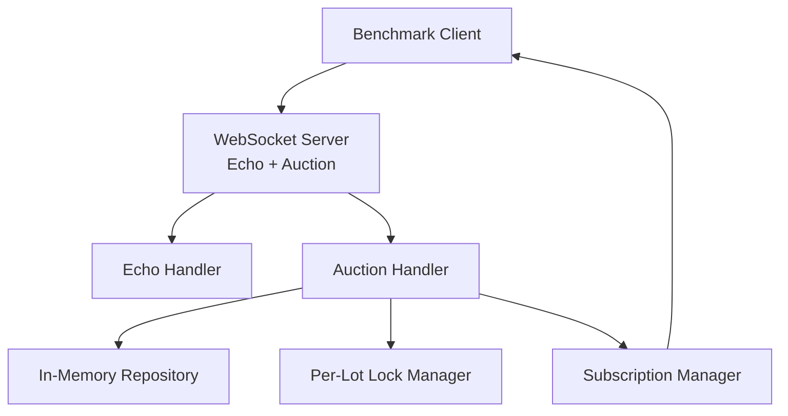
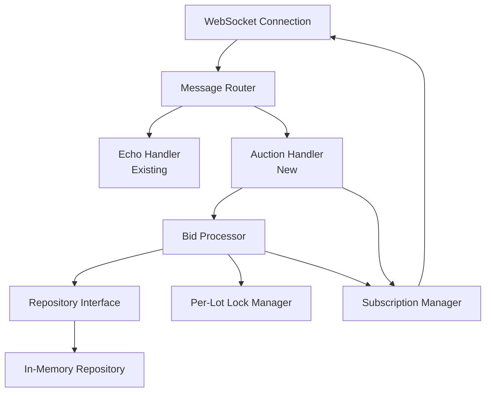
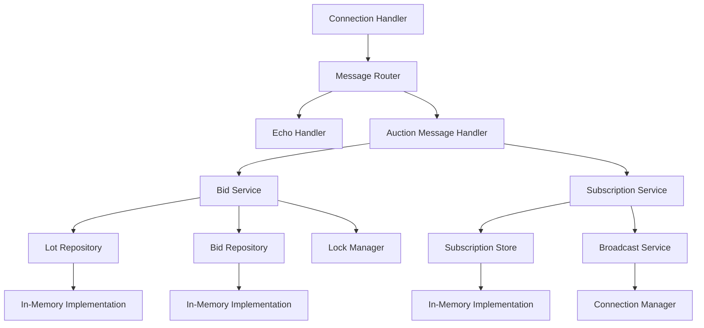

# Design Document

## Overview

This feature extends the existing WebSocket echo servers with auction simulation functionality. The servers will support both echo mode (existing) and auction mode (new) simultaneously. In auction mode, servers maintain in-memory auction state, process bids with validation rules, update lot state atomically using per-lot locking, and broadcast updates to subscribed clients. The benchmark client tracks bid details and performance metrics, logging each bid placement with its outcome (accepted or rejected) and failure reasons. This comprehensive logging enables analysis of bid acceptance rates, failure patterns, and workload characteristics during benchmarking. The implementation uses a repository abstraction to enable future storage backends while maintaining identical behavior across .NET, Go, and Rust for fair benchmarking.

## Architecture

### System Context



The server routes incoming messages to either echo or auction handlers based on message type. Auction handlers manage state, process bids, and broadcast updates.

### Container Diagram



The message router determines which handler to use. Auction functionality is isolated in its own components while preserving echo functionality.

### Component Diagram



Components are organized with clear separation of concerns: routing, business logic, data access, and broadcasting.

## Components and Interfaces

### 1. Message Router

**Purpose:** Route incoming WebSocket messages to the appropriate handler based on message type.

**Location:**
- `.NET`: `src/dotnet/EchoServer/Services/MessageRouter.cs`
- `Go`: `src/go/echo-server/message_router.go`
- `Rust`: `src/rust/echo-server/src/message_router.rs`

**Responsibilities:**
- Parse incoming JSON messages to determine type
- Route auction messages (`JoinLot`, `PlaceBid`) to auction handler
- Route all other messages to echo handler
- Handle invalid/malformed messages

**Interface:**
```csharp
// .NET
public interface IMessageRouter
{
    Task RouteMessageAsync(WebSocket webSocket, string message);
}
```

### 2. Auction Message Handler

**Purpose:** Handle auction-specific WebSocket messages (JoinLot, PlaceBid).

**Location:**
- `.NET`: `src/dotnet/EchoServer/Services/AuctionMessageHandler.cs`
- `Go`: `src/go/echo-server/auction_handler.go`
- `Rust`: `src/rust/echo-server/src/auction_handler.rs`

**Responsibilities:**
- Parse and validate auction messages
- Delegate JoinLot to subscription service
- Delegate PlaceBid to bid service
- Send responses and error messages to clients

### 3. Bid Service

**Purpose:** Process bid placement with validation and atomic state updates.

**Location:**
- `.NET`: `src/dotnet/EchoServer/Services/BidService.cs`
- `Go`: `src/go/echo-server/bid_service.go`
- `Rust`: `src/rust/echo-server/src/bid_service.rs`

**Responsibilities:**
- Validate bid rules (lot open, bid amount > current bid)
- Acquire per-lot lock
- Atomically update lot state (bid amount + bidder ID)
- Store bid in repository
- Release lock
- Trigger broadcast of lot update

**Key Methods:**
- `ProcessBid(lotId, bidderId, amount) -> BidResult`
- `ValidateBid(lot, amount) -> ValidationResult`

### 4. Subscription Service

**Purpose:** Manage client subscriptions to lots and handle broadcasts.

**Location:**
- `.NET`: `src/dotnet/EchoServer/Services/SubscriptionService.cs`
- `Go`: `src/go/echo-server/subscription_service.go`
- `Rust`: `src/rust/echo-server/src/subscription_service.rs`

**Responsibilities:**
- Subscribe client to lot
- Unsubscribe client from lot (on disconnect)
- Get all subscribers for a lot
- Broadcast lot updates to subscribers
- Handle broadcast failures gracefully

**Key Methods:**
- `Subscribe(clientId, lotId)`
- `Unsubscribe(clientId, lotId)`
- `UnsubscribeAll(clientId)`
- `BroadcastUpdate(lotId, lotUpdate)`

### 5. Repository Interface

**Purpose:** Abstract data access to enable future storage backends.

**Location:**
- `.NET`: `src/dotnet/EchoServer/Repositories/ILotRepository.cs`, `IBidRepository.cs`
- `Go`: `src/go/echo-server/repositories/repository.go` (interface)
- `Rust`: `src/rust/echo-server/src/repositories/mod.rs` (traits)

**Interface (C# example):**
```csharp
public interface ILotRepository
{
    Task<Lot?> GetLotAsync(string lotId);
    Task<Lot> CreateLotAsync(string lotId, string auctionId, decimal startingPrice);
    Task UpdateLotAsync(Lot lot);
    Task<List<Lot>> GetAllLotsAsync();
}

public interface IBidRepository
{
    Task AddBidAsync(Bid bid);
    Task<List<Bid>> GetBidsForLotAsync(string lotId);
    Task<Bid?> GetHighestBidAsync(string lotId);
}
```

### 6. In-Memory Repository Implementation

**Purpose:** Initial implementation using in-memory data structures.

**Location:**
- `.NET`: `src/dotnet/EchoServer/Repositories/InMemoryLotRepository.cs`, `InMemoryBidRepository.cs`
- `Go`: `src/go/echo-server/repositories/in_memory_repository.go`
- `Rust`: `src/rust/echo-server/src/repositories/in_memory.rs`

**Data Structures:**
- Lots: `Dictionary<string, Lot>` (lotId -> Lot)
- Bids: `Dictionary<string, List<Bid>>` (lotId -> List<Bid>)
- Thread-safe access using appropriate synchronization primitives

### 7. Lock Manager

**Purpose:** Provide per-lot locking for atomic bid processing.

**Location:**
- `.NET`: `src/dotnet/EchoServer/Services/LockManager.cs`
- `Go`: `src/go/echo-server/lock_manager.go`
- `Rust`: `src/rust/echo-server/src/lock_manager.rs`

**Implementation:**
- `.NET`: `ConcurrentDictionary<string, SemaphoreSlim>` (lotId -> SemaphoreSlim)
- `Go`: `sync.Map` with `sync.Mutex` per lot
- `Rust`: `Arc<Mutex<HashMap<String, Arc<Mutex<()>>>>>` or use `dashmap` crate

**Key Methods:**
- `AcquireLock(lotId) -> LockHandle`
- `ReleaseLock(lockHandle)`

### 8. Connection Manager

**Purpose:** Track active WebSocket connections and associate them with client IDs.

**Location:**
- `.NET`: `src/dotnet/EchoServer/Services/ConnectionManager.cs`
- `Go`: `src/go/echo-server/connection_manager.go`
- `Rust`: `src/rust/echo-server/src/connection_manager.rs`

**Responsibilities:**
- Register client connections
- Unregister on disconnect
- Send messages to specific clients
- Generate unique client IDs

### 9. Bid Metrics Collector (Benchmark Client)

**Purpose:** Track bid operations and their outcomes for performance analysis.

**Location:**
- `.NET`: `src/dotnet/BenchmarkClient/Services/BidMetricsCollector.cs`

**Responsibilities:**
- Record bid details (lotId, bidderId, amount, timestamp) when bid is placed
- Track total number of bids placed
- Track number of bids accepted (based on LotUpdate responses)
- Track number of bids failed (based on Error responses)
- Categorize failure reasons (BidTooLow, LotClosed, Error)
- Maintain count per failure reason type
- Provide bid statistics for report generation

**Key Methods:**
- `RecordBidPlaced(lotId, bidderId, amount, timestamp)`
- `RecordBidAccepted(lotId, bidderId, amount, timestamp)`
- `RecordBidFailed(lotId, bidderId, amount, failureReason, timestamp)`
- `GetBidMetrics() -> BidMetrics`

**Interface:**
```csharp
public interface IBidMetricsCollector
{
    void RecordBidPlaced(string lotId, string bidderId, decimal amount, DateTime timestamp);
    void RecordBidAccepted(string lotId, string bidderId, decimal amount, DateTime timestamp);
    void RecordBidFailed(string lotId, string bidderId, decimal amount, BidFailureReason reason, DateTime timestamp);
    BidMetrics GetMetrics();
}
```

### 10. Message Receiver (Benchmark Client - Auction Mode)

**Purpose:** Parse and handle auction messages (LotUpdate, Error) from the server.

**Location:**
- `.NET`: `src/dotnet/BenchmarkClient/Services/MessageReceiver.cs` (extend existing)

**Responsibilities:**
- Parse incoming LotUpdate messages to identify accepted bids
- Parse incoming Error messages to identify rejected bids
- Extract failure reason from error messages ("Bid amount must be greater..." → BidTooLow, "Lot is closed" → LotClosed)
- Correlate responses with sent bid messages
- Record metrics in BidMetricsCollector

## Data Models

### Lot

**Fields:**
- `LotId` (string): Unique identifier for the lot
- `AuctionId` (string): Identifier of the auction this lot belongs to
- `StartingPrice` (decimal/number): Initial bid amount
- `CurrentBid` (decimal/number): Current highest bid amount
- `CurrentBidder` (string?): ID of the current highest bidder (null if no bids)
- `Status` (enum): `Open` or `Closed`

**Location:**
- `.NET`: `src/dotnet/EchoServer/Models/Lot.cs`
- `Go`: `src/go/echo-server/models/lot.go`
- `Rust`: `src/rust/echo-server/src/models/lot.rs`

### Bid

**Fields:**
- `BidId` (string): Unique identifier for the bid
- `LotId` (string): Lot this bid is for
- `BidderId` (string): ID of the bidder
- `Amount` (decimal/number): Bid amount
- `Timestamp` (DateTime/time.Time/SystemTime): When the bid was placed

**Location:**
- `.NET`: `src/dotnet/EchoServer/Models/Bid.cs`
- `Go`: `src/go/echo-server/models/bid.go`
- `Rust`: `src/rust/echo-server/src/models/bid.rs`

### Message Types

**JoinLot Message:**
```json
{
  "type": "JoinLot",
  "lotId": "lot-123"
}
```

**PlaceBid Message:**
```json
{
  "type": "PlaceBid",
  "lotId": "lot-123",
  "bidderId": "bidder-456",
  "amount": 100.50
}
```

**LotUpdate Message:**
```json
{
  "type": "LotUpdate",
  "lotId": "lot-123",
  "currentBid": 100.50,
  "currentBidder": "bidder-456",
  "status": "Open"
}
```

**Error Message:**
```json
{
  "type": "Error",
  "message": "Lot is closed"
}
```

### Bid Metrics (Benchmark Client)

**Fields:**
- `TotalBidsPlaced` (int): Total number of bid messages sent
- `BidsAccepted` (int): Number of bids accepted by the server
- `BidsFailed` (int): Number of bids rejected by the server
- `FailureReasonBreakdown` (Dictionary<string, int>): Count of failures by reason type
  - "BidTooLow": Count of bids rejected because amount <= current bid
  - "LotClosed": Count of bids rejected because lot is closed
  - "Error": Count of bids rejected due to other errors (invalid format, etc.)
- `BidDetails` (List<BidDetail>): Optional detailed log of each bid (for debugging)

**BidDetail:**
- `LotId` (string): Lot the bid was placed on
- `BidderId` (string): ID of the bidder
- `Amount` (decimal): Bid amount
- `Timestamp` (DateTime): When the bid was placed
- `Outcome` (enum): Accepted or Failed
- `FailureReason` (string?): Failure reason if outcome is Failed

**BidFailureReason Enum:**
- `BidTooLow`: Bid amount is not greater than current bid
- `LotClosed`: Lot is closed and not accepting bids
- `Error`: Other error (invalid message format, etc.)

**Location:**
- `.NET`: `src/dotnet/BenchmarkClient/Models/BidMetrics.cs`

## Error Handling

### Invalid Message Format

**Scenario:** Client sends malformed JSON or missing required fields.

**Handling:**
- Log the error
- Send error message to client: `{"type": "Error", "message": "Invalid message format"}`
- Continue processing other messages
- Do not disconnect the client

### Bid Validation Failures

**Scenario:** Bid fails validation (lot closed, bid too low, etc.).

**Handling:**
- Return error message to the client who placed the bid
- Do not update lot state
- Do not broadcast update
- Log the rejection for debugging
- Benchmark client records the failure with appropriate reason category

**Error Messages:**
- `"Lot is closed"` → Categorized as LotClosed failure reason
- `"Bid amount must be greater than current bid"` → Categorized as BidTooLow failure reason
- `"Lot not found"` → Categorized as Error failure reason

### Repository Errors

**Scenario:** Repository operation fails (shouldn't happen with in-memory, but handle for future).

**Handling:**
- Log the error
- Return error message to client
- Do not crash the server
- Continue processing other operations

### Broadcast Failures

**Scenario:** Sending update to a subscriber fails (connection lost, etc.).

**Handling:**
- Remove the failed subscriber from subscription list
- Continue broadcasting to other subscribers
- Log the failure
- Do not fail the bid operation

### Lock Acquisition Timeout

**Scenario:** Lock cannot be acquired within reasonable time (deadlock prevention).

**Handling:**
- Implement timeout for lock acquisition (e.g., 5 seconds)
- Return error to client if timeout occurs
- Log potential deadlock warning
- Release any acquired locks

## Testing Strategy

### Unit Tests

**Bid Service Tests:**
- Test bid validation (lot closed, bid too low)
- Test successful bid processing
- Test atomic state updates
- Test lock acquisition and release

**Subscription Service Tests:**
- Test subscribe/unsubscribe operations
- Test broadcast to multiple subscribers
- Test cleanup on disconnect
- Test handling of failed broadcasts

**Repository Tests:**
- Test CRUD operations for lots
- Test bid storage and retrieval
- Test concurrent access (thread-safety)

**Message Router Tests:**
- Test routing to echo handler for non-auction messages
- Test routing to auction handler for auction messages
- Test handling of invalid messages

### Integration Tests

**End-to-End Auction Flow:**
- Client connects and joins lot
- Client places bid
- Verify lot state updated
- Verify update broadcast to subscribers
- Multiple clients competing for same lot

**Concurrent Bid Processing:**
- Multiple clients place bids on same lot simultaneously
- Verify only one bid succeeds
- Verify lot state is consistent
- Verify all subscribers receive updates

**Dual Mode Operation:**
- Client sends echo message (should echo)
- Client sends auction message (should process auction)
- Both modes work on same connection
- Multiple clients using different modes

### Performance Tests

**Throughput:**
- Measure bids processed per second
- Measure updates broadcast per second
- Compare across .NET, Go, Rust

**Latency:**
- Measure time from PlaceBid to LotUpdate received
- Measure lock contention impact
- Compare across implementations

**Concurrency:**
- Test with 100, 1000, 10000 concurrent clients
- Test with multiple lots (parallel processing)
- Test with single lot (serialized processing)

**Bid Metrics Collection Tests:**
- Test bid metrics collector records bids placed correctly
- Test bid metrics collector correctly identifies accepted bids (LotUpdate responses)
- Test bid metrics collector correctly identifies rejected bids (Error responses)
- Test failure reason categorization (BidTooLow, LotClosed, Error)
- Test bid correlation between sent bids and received responses
- Test metrics aggregation across multiple clients
- Test bid metrics included in JSON report only in auction mode
- Test bid metrics excluded from JSON report in echo mode
- Verify failure reason breakdown sums to total failures
- Verify total bids placed equals accepted + failed

## Implementation Notes

### Message Type Detection

Messages are routed based on JSON `type` field:
- If `type` is `"JoinLot"` or `"PlaceBid"` → Auction handler
- Otherwise → Echo handler

This allows automatic mode detection without explicit mode switching.

### Per-Lot Locking Strategy

**Implementation Pattern:**
1. Get or create lock for lot ID
2. Acquire lock (with timeout)
3. Validate bid
4. Update lot state atomically
5. Store bid
6. Release lock
7. Broadcast update (outside lock)

**Lock Granularity:**
- One lock per lot ID
- No global lock (allows parallel processing of different lots)
- Locks are held only during state update (minimal contention)

### Broadcast Strategy

**Implementation:**
- Maintain subscription map: `lotId -> Set<clientId>`
- When lot updates, iterate over subscribers
- Send update message to each subscriber
- Remove failed subscribers from set
- Use async/goroutine/task for each send (non-blocking)

### Bid Logging Strategy (Benchmark Client)

**Implementation Pattern:**
1. When PlaceBid message is sent:
   - Record bid placement with lotId, bidderId, amount, timestamp
   - Increment total bids placed counter
   - Store bid detail for correlation with response
   
2. When LotUpdate message is received:
   - Correlate with pending bid (match by lotId and bidderId or sequence)
   - Record bid accepted
   - Increment bids accepted counter
   - Remove from pending bids list
   
3. When Error message is received:
   - Correlate with pending bid
   - Parse error message to determine failure reason:
     - Contains "greater than current bid" → BidTooLow
     - Contains "Lot is closed" → LotClosed
     - Otherwise → Error
   - Record bid failed with categorized reason
   - Increment bids failed counter
   - Increment reason-specific counter
   - Remove from pending bids list

**Failure Reason Categorization:**
- Error message parsing uses substring matching:
  - `"Bid amount must be greater than current bid"` → BidTooLow
  - `"Bid amount must be greater than"` → BidTooLow (partial match)
  - `"Lot is closed"` → LotClosed
  - `"closed"` (case-insensitive) → LotClosed
  - All other errors → Error category

**Correlation Strategy:**
- Maintain a queue/list of pending bids (FIFO)
- Match responses to bids by lotId and approximate timing (within 1 second)
- Use sequence numbers if available for more precise matching
- Handle out-of-order responses gracefully

### Repository Thread Safety

**In-Memory Implementation:**
- `.NET`: Use `ConcurrentDictionary` or lock around `Dictionary`
- `Go`: Use `sync.Map` or `sync.RWMutex` with `map`
- `Rust`: Use `Arc<Mutex<HashMap>>` or `dashmap::DashMap`

### Decimal Precision

**Bid Amounts:**
- Use appropriate decimal type for each language:
  - `.NET`: `decimal` (128-bit, precise)
  - `Go`: `float64` or custom decimal type
  - `Rust`: `rust_decimal::Decimal` crate
- Ensure consistent precision across languages
- JSON serialization should preserve precision

### Client ID Generation

**Strategy:**
- Generate unique ID on connection: UUID/GUID
- Associate WebSocket connection with client ID
- Use client ID for subscriptions and bid tracking

## Dependencies

### .NET
- `System.Text.Json` (already used)
- No additional dependencies required

### Go
- `encoding/json` (standard library)
- No additional dependencies required

### Rust
- `serde`, `serde_json` (for JSON serialization)
- `dashmap` (optional, for concurrent HashMap)
- `uuid` (for client ID generation)

## Migration Path

### Backward Compatibility

- Existing echo functionality remains unchanged
- Echo benchmarks continue to work
- No breaking changes to existing code
- Auction functionality is additive

### Implementation Phases

1. **Phase 1:** Add message routing and auction message handler skeleton
2. **Phase 2:** Implement repository interfaces and in-memory implementations
3. **Phase 3:** Implement bid service with validation and locking
4. **Phase 4:** Implement subscription service and broadcasting
5. **Phase 5:** Integration testing and cross-language verification
6. **Phase 6:** Benchmark client updates for auction scenarios

## Report Format

### JSON Report Structure

The benchmark client generates JSON reports that include bid metrics when running in auction mode. The report extends the existing structure with a `bidMetrics` section.

**Bid Metrics Section (Auction Mode Only):**
```json
{
  "bidMetrics": {
    "totalBidsPlaced": 1000,
    "bidsAccepted": 750,
    "bidsFailed": 250,
    "acceptanceRate": 0.75,
    "failureRate": 0.25,
    "failureReasonBreakdown": {
      "BidTooLow": 180,
      "LotClosed": 50,
      "Error": 20
    }
  }
}
```

**Complete Report Structure with Bid Metrics:**
```json
{
  "schemaVersion": "1.0",
  "metadata": {
    "serverLanguage": "dotnet|go|rust",
    "serverVersion": "1.0.0",
    "scenarioName": "string",
    "testStartTime": "ISO8601 timestamp",
    "testEndTime": "ISO8601 timestamp",
    "testDurationSeconds": 0.0,
    "mode": "Echo|Auction"
  },
  "clientConfig": {
    "clientCount": 0,
    "messagesPerSecondPerClient": 0,
    "messageSizeBytes": 0,
    "messagePattern": "FixedRate|Burst|RampUp"
  },
  "serverConfig": {
    "port": 0,
    "language": "dotnet|go|rust",
    "buildConfiguration": "string"
  },
  "throughput": {
    "totalMessagesSent": 0,
    "totalMessagesReceived": 0,
    "messagesPerSecond": 0.0,
    "messagesPerSecondPerClient": 0.0
  },
  "latency": {
    "p50Milliseconds": 0.0,
    "p90Milliseconds": 0.0,
    "p99Milliseconds": 0.0,
    "maxMilliseconds": 0.0,
    "minMilliseconds": 0.0,
    "meanMilliseconds": 0.0
  },
  "errors": {
    "totalConnectionErrors": 0,
    "totalMessageMismatches": 0,
    "errorRatePerSecond": 0.0
  },
  "bidMetrics": {
    "totalBidsPlaced": 0,
    "bidsAccepted": 0,
    "bidsFailed": 0,
    "acceptanceRate": 0.0,
    "failureRate": 0.0,
    "failureReasonBreakdown": {
      "BidTooLow": 0,
      "LotClosed": 0,
      "Error": 0
    }
  },
  "resourceUsage": {
    "cpu": [
      {
        "timestamp": "ISO8601 timestamp",
        "cpuPercent": 0.0
      }
    ],
    "memory": [
      {
        "timestamp": "ISO8601 timestamp",
        "memoryBytes": 0
      }
    ]
  }
}
```

**Report Generation Rules:**
- `bidMetrics` section is **only included** when mode is "Auction"
- When mode is "Echo", the `bidMetrics` section is omitted
- `acceptanceRate` = bidsAccepted / totalBidsPlaced
- `failureRate` = bidsFailed / totalBidsPlaced
- All failure reason counts should sum to `bidsFailed`
- `totalBidsPlaced` should equal `bidsAccepted + bidsFailed`

**Location:**
- `.NET`: `src/dotnet/BenchmarkClient/Services/JsonReportGenerator.cs` (extend existing)

## Cross-Language Consistency

### Identical Behavior Requirements

1. **Bid Validation:** Same rules in all languages
2. **Lock Behavior:** Per-lot locking, no global lock
3. **Message Format:** Identical JSON structure
4. **Error Messages:** Same error text and format
5. **State Updates:** Atomic updates with same semantics
6. **Broadcast Logic:** Same subscription and broadcast behavior

### Testing for Consistency

- Create test scenarios that produce identical results across languages
- Verify message formats match exactly
- Verify error messages are identical
- Verify state transitions are identical

