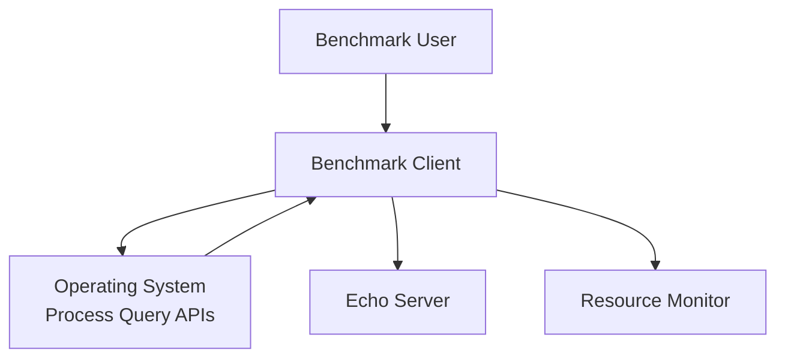
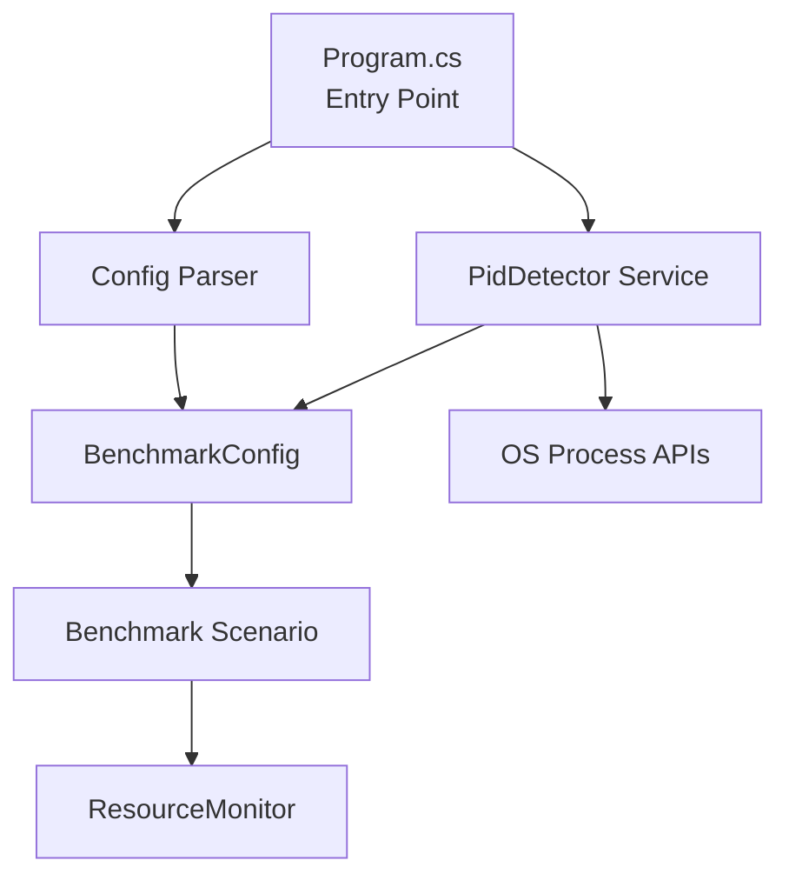

# Design Document

## Overview

This feature adds automatic detection of the server process ID (PID) by querying the operating system to find which process is listening on the TCP/IP port specified in the server URL. This eliminates the need for users to manually specify the `--server-pid` option while maintaining backward compatibility.

The implementation will:
1. Extract the port number from the server URL
2. Query the OS to find the process listening on that port
3. Set `config.ServerProcessId` if found, or log a warning if not found
4. Skip automatic detection if `--server-pid` is explicitly provided

## Architecture

### System Context



The benchmark client queries the operating system's process/network APIs to identify the server PID, then uses that PID for resource monitoring.

### Container Diagram



The `PidDetector` service is a new component that handles cross-platform PID detection. It integrates into the existing configuration parsing flow.

## Components and Interfaces

### 1. IPidDetector Interface

**Location:** `src/dotnet/BenchmarkClient/Interfaces/IPidDetector.cs`

**Purpose:** Abstract interface for PID detection to enable testing and platform-specific implementations.

```csharp
namespace BenchmarkClient.Interfaces;

public interface IPidDetector
{
    /// <summary>
    /// Attempts to find the process ID listening on the specified port.
    /// </summary>
    /// <param name="port">The TCP port number to query</param>
    /// <returns>The process ID if found, null otherwise</returns>
    int? DetectPidByPort(int port);
}
```

### 2. PidDetector Service

**Location:** `src/dotnet/BenchmarkClient/Services/PidDetector.cs`

**Purpose:** Cross-platform implementation of PID detection using platform-specific strategies.

**Responsibilities:**
- Detect the current operating system (Windows, Linux, macOS)
- Delegate to platform-specific detection methods
- Handle errors gracefully and return null on failure
- Log warnings when detection fails

**Platform-Specific Strategies:**

1. **Windows:**
   - Use `netstat -ano` command to find processes listening on the port
   - Parse output to extract PID
   - Alternative: Use Windows Management Instrumentation (WMI) if available

2. **Linux:**
   - Use `lsof -i :<port>` command to find the process
   - Parse output to extract PID
   - Fallback: Parse `/proc/net/tcp` if `lsof` is not available

3. **macOS:**
   - Use `lsof -i :<port>` command (same as Linux)
   - Parse output to extract PID

**Error Handling:**
- If the required command is not available, log a warning and return null
- If parsing fails, log a warning and return null
- If permissions are insufficient, log an error and return null
- If multiple processes are found, log a warning and return the first PID

### 3. UrlPortExtractor Utility

**Location:** `src/dotnet/BenchmarkClient/Services/UrlPortExtractor.cs`

**Purpose:** Extract port number from server URL with proper handling of default ports.

**Responsibilities:**
- Parse WebSocket URLs (ws://, wss://)
- Extract port number from URL
- Handle default ports (80 for ws://, 443 for wss://)
- Handle invalid URLs gracefully

**Note:** This functionality already exists in `JsonReportGenerator.ExtractPort()`, but we'll extract it to a shared utility class to avoid duplication.

### 4. Integration with Program.cs

**Location:** `src/dotnet/BenchmarkClient/Program.cs`

**Changes:**
- After parsing configuration, check if `ServerProcessId` is not set
- If not set, extract port from `ServerUrl` using `UrlPortExtractor`
- Use `PidDetector` to detect PID from port
- Set `config.ServerProcessId` if detection succeeds
- Log appropriate messages for success/failure

## Data Models

### No New Data Models Required

The existing `BenchmarkConfig` model already has `ServerProcessId` as a nullable `int?`, which is sufficient for this feature.

## Error Handling

### Detection Failures

**Scenario:** PID detection fails (no process found, command unavailable, permission denied)

**Handling:**
- Log a warning message explaining why detection failed
- Continue execution without resource monitoring
- Do not throw exceptions or stop the benchmark

**Example Log Messages:**
- `"Warning: Could not detect server PID for port {port}. Resource monitoring will be disabled."`
- `"Warning: 'lsof' command not found. Cannot detect server PID. Resource monitoring will be disabled."`
- `"Warning: Insufficient permissions to query process information. Resource monitoring will be disabled."`

### Multiple Processes on Same Port

**Scenario:** Multiple processes are found listening on the same port

**Handling:**
- Log a warning message indicating multiple matches
- Return the first PID found
- Continue with resource monitoring for that PID

**Example Log Message:**
- `"Warning: Multiple processes found listening on port {port}. Using PID {pid}."`

### Invalid URL Format

**Scenario:** Server URL cannot be parsed to extract port

**Handling:**
- Log an error message
- Skip automatic PID detection
- Continue execution without resource monitoring

**Example Log Message:**
- `"Error: Could not parse server URL '{url}' to extract port. Skipping automatic PID detection."`

### Platform Detection Failures

**Scenario:** Cannot determine the operating system

**Handling:**
- Log a warning message
- Skip automatic PID detection
- Continue execution without resource monitoring

## Testing Strategy

### Unit Tests

**Location:** `src/dotnet/BenchmarkClient.Tests/Services/PidDetectorTests.cs`

**Test Cases:**
1. **Windows Detection:**
   - Mock `netstat` command output
   - Verify PID extraction from output
   - Test error handling for invalid output

2. **Linux/macOS Detection:**
   - Mock `lsof` command output
   - Verify PID extraction from output
   - Test error handling for invalid output

3. **Platform Detection:**
   - Test correct platform identification on Windows
   - Test correct platform identification on Linux
   - Test correct platform identification on macOS

4. **Error Scenarios:**
   - Test behavior when command is not available
   - Test behavior when command fails
   - Test behavior when no process is found
   - Test behavior when multiple processes are found

**Location:** `src/dotnet/BenchmarkClient.Tests/Services/UrlPortExtractorTests.cs`

**Test Cases:**
1. **Port Extraction:**
   - Test extraction from `ws://localhost:8080`
   - Test extraction from `ws://127.0.0.1:8080`
   - Test extraction from `wss://example.com:443`
   - Test default port for `ws://localhost` (80)
   - Test default port for `wss://localhost` (443)

2. **Error Handling:**
   - Test invalid URL format
   - Test null or empty URL

### Integration Tests

**Location:** `src/dotnet/BenchmarkClient.IntegrationTests/AutoPidDetectionTests.cs`

**Test Cases:**
1. **End-to-End Detection:**
   - Start a test server on a known port
   - Run benchmark client without `--server-pid`
   - Verify PID is automatically detected
   - Verify resource monitoring is active

2. **Detection Failure:**
   - Run benchmark client with a port that has no listener
   - Verify warning is logged
   - Verify benchmark continues without resource monitoring

3. **Explicit PID Override:**
   - Start a test server
   - Run benchmark client with `--server-pid` explicitly set
   - Verify automatic detection is skipped
   - Verify provided PID is used

## Implementation Notes

### Command Execution

For cross-platform command execution, we'll use `Process.Start()` with appropriate shell commands:

- **Windows:** `netstat -ano | findstr :<port>`
- **Linux/macOS:** `lsof -i :<port> -t` (the `-t` flag returns only PIDs)

### Parsing Strategy

**Windows `netstat` output format:**
```
TCP    0.0.0.0:8080           0.0.0.0:0              LISTENING       12345
```
We need to extract the PID from the last column.

**Linux/macOS `lsof` output format:**
```
COMMAND   PID USER   FD   TYPE DEVICE SIZE/OFF NODE NAME
echo-ser 12345 user   3u  IPv4  12345      0t0  TCP *:8080 (LISTEN)
```
We need to extract the PID from the second column.

Alternatively, using `lsof -i :<port> -t` returns only the PID, simplifying parsing.

### Performance Considerations

- PID detection should be fast (< 1 second)
- Cache detection result if needed (though typically only called once at startup)
- Use async/await if command execution is slow

### Security Considerations

- Command execution should be safe (no user input in commands)
- Handle cases where user lacks permissions gracefully
- Do not expose sensitive process information in logs

## Dependencies

### No New External Dependencies

The implementation will use only .NET standard library APIs:
- `System.Diagnostics.Process` for command execution
- `System.Runtime.InteropServices.RuntimeInformation` for platform detection
- `System.Uri` for URL parsing (already used)

## Migration Path

### Backward Compatibility

- Existing `--server-pid` option continues to work
- If `--server-pid` is provided, automatic detection is skipped
- If automatic detection fails, behavior matches current behavior (no resource monitoring)

### No Breaking Changes

- All existing command-line options remain unchanged
- Existing scripts and workflows continue to work
- New functionality is additive only

