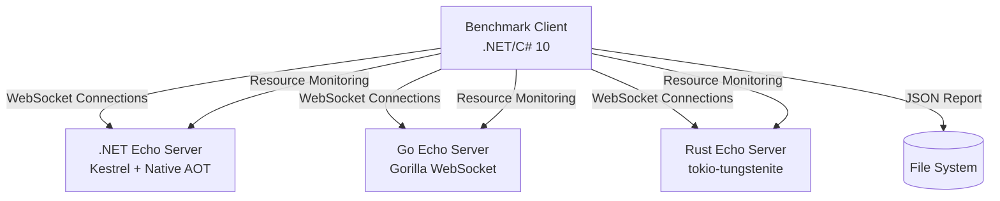
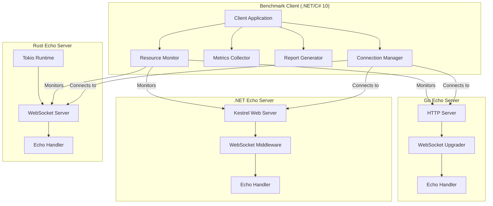
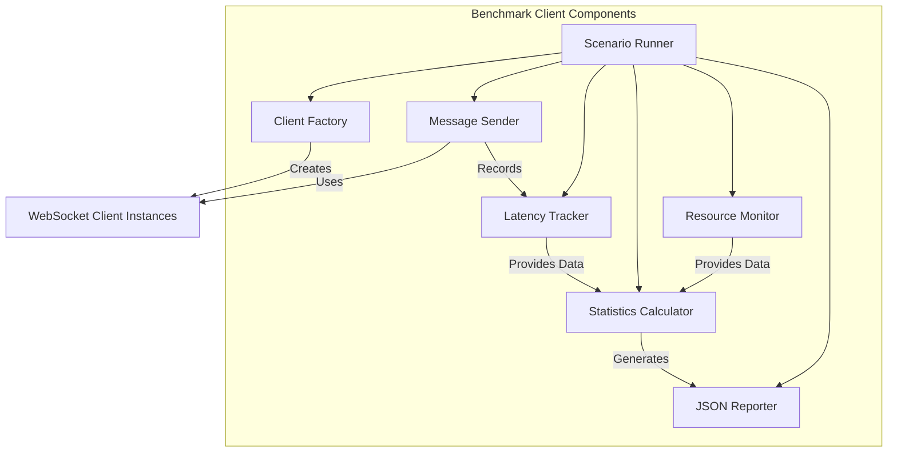

# Design Document - Basic Echo Benchmark

## Overview

This document describes the architecture and design of the Basic Echo Benchmark system, which provides a minimal WebSocket echo server benchmarking suite. The system consists of echo servers implemented in .NET 10, Go, and Rust, along with a .NET/C# 10 benchmark client that generates load and collects performance metrics.

The design emphasizes minimalism, performance measurement accuracy, and cross-language comparability through standardized interfaces and reporting formats.

## Architecture

### System Context Diagram

The system context shows the high-level interactions between the benchmark client and the echo servers:



**Key Relationships:**
- The benchmark client establishes WebSocket connections to any of the three echo servers
- The client monitors server resource usage (CPU, memory) during benchmarks
- The client generates JSON reports that are written to the file system

### Container Diagram

The container diagram shows the internal structure of each component:



**Container Responsibilities:**
- **Benchmark Client**: Orchestrates test scenarios, manages connections, collects metrics, generates reports
- **.NET Echo Server**: Minimal Kestrel-based WebSocket server with echo functionality
- **Go Echo Server**: Minimal HTTP server with Gorilla WebSocket upgrade and echo functionality
- **Rust Echo Server**: Minimal async WebSocket server with tokio-tungstenite and echo functionality

### Component Diagram

The component diagram details the internal structure of the benchmark client:



**Component Responsibilities:**
- **Scenario Runner**: Executes predefined test scenarios (single client, 100-client burst, 1000-client steady load)
- **Client Factory**: Creates and manages WebSocket client instances
- **Message Sender**: Sends messages according to configured rate and pattern
- **Latency Tracker**: Records round-trip latency for each message
- **Statistics Calculator**: Computes throughput, latency percentiles, and aggregates resource metrics
- **Resource Monitor**: Monitors server process CPU and memory usage
- **JSON Reporter**: Generates standardized JSON reports

## Components and Interfaces

### Echo Server Interface

All echo servers must implement the following behavior (not a formal interface, but behavioral contract):

**Connection Handling:**
- Accept WebSocket connections on a configurable port (default: 8080)
- Support WebSocket protocol upgrade from HTTP/HTTPS
- Handle multiple concurrent connections
- Gracefully close connections on client disconnect or error

**Message Handling:**
- Receive text and binary WebSocket messages
- Echo received messages back to the same client without modification
- Handle ping/pong frames (if supported by library)
- Process messages asynchronously to maximize throughput

**Error Handling:**
- Close connections with appropriate WebSocket close codes on errors
- Log errors without crashing the server
- Continue processing other connections when one connection fails

### Benchmark Client API

#### Configuration Interface

```csharp
public class BenchmarkConfig
{
    public string ServerUrl { get; set; } = "ws://localhost:8080";
    public int ClientCount { get; set; } = 1;
    public int MessagesPerSecondPerClient { get; set; } = 100;
    public int MessageSizeBytes { get; set; } = 64;
    public TimeSpan Duration { get; set; } = TimeSpan.FromSeconds(30);
    public MessagePattern Pattern { get; set; } = MessagePattern.FixedRate;
    public string ScenarioName { get; set; } = "single-client";
    public string ServerLanguage { get; set; } = "dotnet";
}

public enum MessagePattern
{
    FixedRate,      // Constant rate per client
    Burst,          // All clients send simultaneously
    RampUp          // Gradually increase rate
}
```

#### Metrics Collection Interface

```csharp
public interface IMetricsCollector
{
    void RecordMessageSent(DateTime timestamp, int clientId, int messageId, int size);
    void RecordMessageReceived(DateTime timestamp, int clientId, int messageId, TimeSpan latency);
    void RecordConnectionError(int clientId, string error);
    void RecordMessageMismatch(int clientId, int messageId);
    BenchmarkMetrics GetMetrics();
}

public class BenchmarkMetrics
{
    public int TotalMessagesSent { get; set; }
    public int TotalMessagesReceived { get; set; }
    public int TotalConnectionErrors { get; set; }
    public int TotalMessageMismatches { get; set; }
    public double MessagesPerSecond { get; set; }
    public LatencyPercentiles Latency { get; set; }
    public List<ResourceSnapshot> ResourceUsage { get; set; }
}

public class LatencyPercentiles
{
    public double P50 { get; set; }  // milliseconds
    public double P90 { get; set; }  // milliseconds
    public double P99 { get; set; }  // milliseconds
    public double Max { get; set; }  // milliseconds
    public double Min { get; set; }  // milliseconds
    public double Mean { get; set; } // milliseconds
}

public class ResourceSnapshot
{
    public DateTime Timestamp { get; set; }
    public double CpuPercent { get; set; }
    public long MemoryBytes { get; set; }
}
```

#### Resource Monitoring Interface

```csharp
public interface IResourceMonitor
{
    void StartMonitoring(int serverProcessId);
    void StopMonitoring();
    List<ResourceSnapshot> GetSnapshots();
}
```

#### Report Generation Interface

```csharp
public interface IReportGenerator
{
    void GenerateReport(BenchmarkMetrics metrics, BenchmarkConfig config, string outputPath);
}
```

### JSON Report Schema

The JSON report follows this standardized schema:

```json
{
  "schemaVersion": "1.0",
  "metadata": {
    "serverLanguage": "dotnet|go|rust",
    "serverVersion": "string",
    "scenarioName": "string",
    "testStartTime": "ISO8601 timestamp",
    "testEndTime": "ISO8601 timestamp",
    "testDurationSeconds": 0.0
  },
  "clientConfig": {
    "clientCount": 0,
    "messagesPerSecondPerClient": 0,
    "messageSizeBytes": 0,
    "messagePattern": "FixedRate|Burst|RampUp"
  },
  "serverConfig": {
    "port": 0,
    "language": "dotnet|go|rust",
    "buildConfiguration": "string (e.g., NativeAOT)"
  },
  "throughput": {
    "totalMessagesSent": 0,
    "totalMessagesReceived": 0,
    "messagesPerSecond": 0.0,
    "messagesPerSecondPerClient": 0.0
  },
  "latency": {
    "p50Milliseconds": 0.0,
    "p90Milliseconds": 0.0,
    "p99Milliseconds": 0.0,
    "maxMilliseconds": 0.0,
    "minMilliseconds": 0.0,
    "meanMilliseconds": 0.0
  },
  "errors": {
    "totalConnectionErrors": 0,
    "totalMessageMismatches": 0,
    "errorRatePerSecond": 0.0
  },
  "resourceUsage": {
    "cpu": [
      {
        "timestamp": "ISO8601 timestamp",
        "cpuPercent": 0.0
      }
    ],
    "memory": [
      {
        "timestamp": "ISO8601 timestamp",
        "memoryBytes": 0
      }
    ]
  }
}
```

## Data Models

### Message Format

Messages sent by the benchmark client include a unique identifier for matching requests with responses:

```csharp
public class BenchmarkMessage
{
    public int MessageId { get; set; }
    public int ClientId { get; set; }
    public DateTime SentTimestamp { get; set; }
    public byte[] Payload { get; set; }  // Configurable size, filled with test data
}
```

The message is serialized as JSON for text messages or as binary data. The echo server must return the exact same content.

### Latency Measurement

Each message round-trip is measured:

```csharp
public class LatencyMeasurement
{
    public int MessageId { get; set; }
    public int ClientId { get; set; }
    public DateTime SentTime { get; set; }
    public DateTime ReceivedTime { get; set; }
    public TimeSpan Latency { get; set; }
}
```

### Connection State

Each client connection maintains state:

```csharp
public class ClientConnection
{
    public int ClientId { get; set; }
    public ClientWebSocket WebSocket { get; set; }
    public DateTime ConnectedAt { get; set; }
    public int MessagesSent { get; set; }
    public int MessagesReceived { get; set; }
    public List<LatencyMeasurement> LatencyMeasurements { get; set; }
    public bool IsConnected { get; set; }
}
```

## Error Handling

### Connection Errors

**Scenario**: Client fails to connect to server
- **Handling**: Record error in metrics, continue with other clients
- **Recovery**: Retry connection (configurable retry count, default: 0 for benchmark accuracy)
- **Reporting**: Include connection errors in JSON report

**Scenario**: Connection drops during benchmark
- **Handling**: Record error, mark connection as disconnected
- **Recovery**: Do not reconnect (maintains benchmark integrity)
- **Reporting**: Include in connection error count

### Message Errors

**Scenario**: Message send fails
- **Handling**: Record error, continue with next message
- **Recovery**: None (fail fast for accurate benchmarking)
- **Reporting**: Include in error metrics

**Scenario**: Echo response doesn't match sent message
- **Handling**: Record mismatch, continue benchmark
- **Recovery**: None (data integrity issue, not recoverable)
- **Reporting**: Include in message mismatch count

### Resource Exhaustion

**Scenario**: Server runs out of memory
- **Handling**: Server crashes, benchmark client detects connection failures
- **Recovery**: None (indicates server limitation)
- **Reporting**: Record high error rate, include in report

**Scenario**: Too many file descriptors/connections
- **Handling**: Connection failures, recorded as errors
- **Recovery**: None (system limitation)
- **Reporting**: Include in connection error metrics

### Server-Side Errors

**Scenario**: Server receives malformed WebSocket frame
- **Handling**: Server closes connection with appropriate close code
- **Recovery**: Client records connection error
- **Reporting**: Included in connection error count

**Scenario**: Server internal error processing message
- **Handling**: Server logs error, closes affected connection
- **Recovery**: Other connections continue normally
- **Reporting**: Client records connection error for affected client

## Testing Strategy

### Unit Tests

#### Echo Server Unit Tests

**For each server implementation (.NET, Go, Rust):**

1. **Connection Tests**
   - Test server accepts WebSocket connections
   - Test server rejects non-WebSocket HTTP requests
   - Test server handles connection close gracefully

2. **Message Echo Tests**
   - Test server echoes text messages correctly
   - Test server echoes binary messages correctly
   - Test server handles empty messages
   - Test server handles large messages (up to 64KB)
   - Test server handles multiple concurrent messages

3. **Error Handling Tests**
   - Test server closes connection on malformed frames
   - Test server handles client disconnect gracefully
   - Test server continues processing other connections when one fails

#### Benchmark Client Unit Tests

1. **Configuration Tests**
   - Test configuration validation
   - Test default values
   - Test configuration serialization

2. **Metrics Collection Tests**
   - Test latency measurement accuracy
   - Test percentile calculation (p50, p90, p99)
   - Test throughput calculation
   - Test error counting

3. **Resource Monitoring Tests**
   - Test process ID resolution
   - Test CPU percentage calculation
   - Test memory usage retrieval
   - Test snapshot collection

4. **Report Generation Tests**
   - Test JSON schema validity
   - Test all metrics included in report
   - Test timestamp formatting
   - Test file writing

### Integration Tests

1. **Client-Server Integration Tests**
   - Test single client echo (text and binary)
   - Test multiple concurrent clients
   - Test message rate limiting
   - Test connection lifecycle

2. **End-to-End Scenario Tests**
   - Test single client scenario execution
   - Test 100-client burst scenario
   - Test 1000-client steady load scenario
   - Verify metrics collection accuracy

3. **Cross-Language Compatibility Tests**
   - Test .NET client against .NET server
   - Test .NET client against Go server
   - Test .NET client against Rust server
   - Verify consistent behavior across servers

### Performance Test Framework

1. **Baseline Performance Tests**
   - Establish baseline metrics for each server
   - Verify servers meet minimum performance thresholds
   - Compare startup times

2. **Load Testing**
   - Test servers under increasing load
   - Identify maximum sustainable throughput
   - Measure resource usage scaling

3. **Stability Tests**
   - Run extended duration tests (10+ minutes)
   - Verify no memory leaks
   - Verify consistent performance over time

### Test Data and Fixtures

1. **Message Payloads**
   - Small messages (64 bytes)
   - Medium messages (1KB)
   - Large messages (64KB)
   - Binary test patterns

2. **Test Scenarios**
   - Predefined scenario configurations
   - Parameterized test cases
   - Scenario validation

### Test Execution Strategy

1. **Isolated Test Environment**
   - Each test runs against a fresh server instance
   - Tests clean up resources after execution
   - No shared state between tests

2. **Deterministic Testing**
   - Fixed random seeds for reproducible tests
   - Controlled timing for latency tests
   - Mock resource monitoring for unit tests

3. **Performance Test Isolation**
   - Performance tests run separately from unit/integration tests
   - Performance tests may require longer timeouts
   - Performance test results stored separately

## Implementation Notes

### .NET Echo Server

- Use ASP.NET Core Minimal API or WebApplication
- Configure Kestrel for WebSocket support
- Enable Native AOT compilation (`<PublishAot>true</PublishAot>`)
- Use async/await for all I/O operations
- Minimize allocations in hot paths

### Go Echo Server

- Use `net/http` with Gorilla WebSocket upgrader
- Use goroutines for concurrent connection handling
- Minimize allocations, use connection pooling if needed
- Build as static binary

### Rust Echo Server

- Use `tokio` runtime for async I/O
- Use `tokio-tungstenite` for WebSocket handling
- Use `tokio::spawn` for concurrent connections
- Build with release optimizations

### Benchmark Client

- Use `System.Net.WebSockets.ClientWebSocket` for connections
- Use async/await throughout
- Implement connection pooling for high client counts
- Use high-precision timestamps (`DateTime.UtcNow` with sufficient precision)
- Implement efficient latency tracking (consider using arrays for measurements)
- Use `System.Diagnostics.Process` for resource monitoring
- Use `System.Text.Json` for JSON serialization

## Security Considerations

This is a benchmarking tool, not a production system. Security is not a primary concern, but:

- Servers should bind to localhost by default (not expose to network)
- No authentication or authorization required
- No input validation needed (echo servers echo everything)
- Resource limits may be necessary to prevent system overload during benchmarks

## Deployment Considerations

- Each server should be a standalone executable
- Servers should accept command-line arguments for port configuration
- Benchmark client should be a standalone executable
- All components should be cross-platform where possible (.NET and Go are, Rust may require platform-specific builds)

