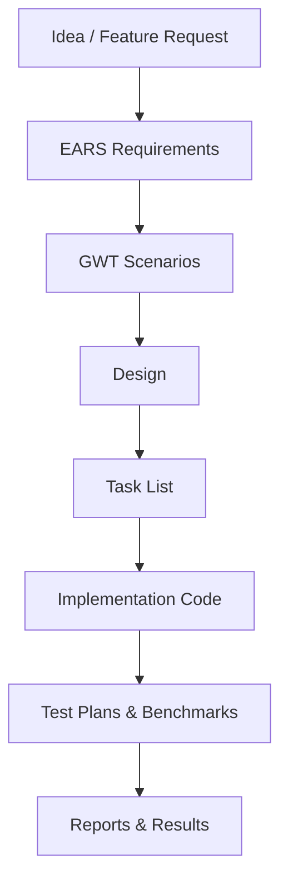

# Socket Benchmarks – Project Overview

## Executive Summary
Socket Benchmarks is a comparative performance evaluation project designed to test, measure, and document the real-world behavior of various WebSocket / TCP socket server implementations across different languages.

The primary goal is to determine how .NET 10 (C#), Go, Rust and (optionally later) C++ behave under identical loads so that we can make informed architectural decisions for real-time bidding workloads in the MarkNet auction platform.

## Project Vision
Create a reproducible, spec-driven benchmarking suite that measures:
- Raw throughput (messages/sec)
- Latency (p50, p90, p99, max)
- Concurrency handling (1, 100, 1,000, 10,000 clients)
- Stability / memory usage / CPU usage under load
- Behavior under burst and sustained message patterns
- Startup performance
- Build size and runtime footprint (AOT options, trimming, etc.)

## Why This Project Exists
We need **data** — not opinions — to decide whether .NET or Go (or Rust) is the right language for the real-time socket layer of the auction bidding engine.

The benchmark suite:
- MUST be unbiased.
- MUST use identical scenarios across languages.
- MUST be easy to rerun later.
- MUST be spec-driven so AI tools can reliably generate/update test harnesses.

## Core Capabilities
This project contains:

### **1. Multi-language socket server implementations**
- `.NET 10` WebSocket server (Native AOT)
- `Go` WebSocket server - `Gorilla`
- `Go` WebSocket server - `Melody`
- `Rust` WebSocket server
- Optionally C++ WebSocket server later

### **2. A language-agnostic benchmark client**
A load generator capable of:
- Spawning N clients
- Sending messages at fixed or ramped rates
- Recording round-trip latency
- Producing standardized output files

### **3. Spec-Driven Development workflow**
Using:
- Steering files
- EARS requirements — used to define clear, unambiguous system requirements written in structured natural language.
- GWT scenarios — used to express executable, testable scenarios (Given/When/Then) derived from EARS requirements.
- C4 diagrams for architecture
- Task lists
- Test plans (unit / integration / perf)

### **4. Repeatable benchmark scenarios**
Each scenario will be a `.mdc` spec file under `specs/scenarios/` describing:
- Given conditions
- When actions
- Then measurable outcomes

Examples:
- Single client echo test
- 100-client burst
- 1000-client steady load
- Fan-in publisher
- Fan-out broadcaster

### **5. Reporting**
- JSON report output
- Optional HTML reports
- Graphs showing latency distributions

## Technical Architecture
- Kestrel WebSocket server for .NET
- Gorilla/Melody for Go
- Each server configured as minimal as possible
- Native AOT / build trimming enabled for .NET
- Lightweight build for Go
- Shared benchmark client used against all servers

## Non-Goals
This project **does not** aim to:
- Build production-ready servers
- Implement business logic
- Compare frameworks (SignalR vs others)
- Evaluate messaging brokers
- SignalR is intentionally excluded from this project because the goal is to measure raw socket performance, not higher-level frameworks.

This is **raw socket performance only**.

## Success Metrics

The project is successful when:
- Specs exist for each scenario
- Multiple languages run the exact same tests
- Reports can be generated with one command
- Results are comparable and unbiased
- Cursor can generate/update code entirely from specs

## Specification Flow Diagram

